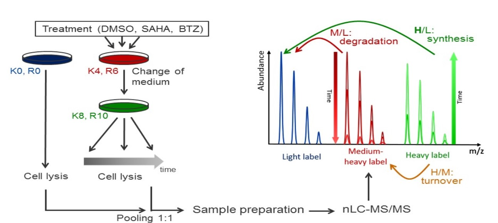

```{r setup, include=FALSE}
knitr::opts_chunk$set(echo = TRUE)
```
# Abstract

The aim of this package is to provide biolgist a quick way to look at these experimental setup. 

# Introduction

Introduction about the TMT-pulse SILAC approach, experimental setups.



The package uses nonlinear least square (NLS) method to fit protein turnover curves. For the degradation curve, the following model is fitted:

$$ f(t) = (A-B) \cdot e^{-(k_d + \frac{ln2}{t_{cc}}) \cdot t} + B$$
The synthesis curve, the following model is fitted
$$ f(t) = (B-A) \cdot e^{-(k_s + \frac{ln2}{t_{cc}}) \cdot t} + A $$
where $k_d$ and $k_s$ are the degradation and systhesis constant respectively, which are going to be estimated. where $t$ is the time points given in hours and $t_{cc}$ is the cell doubling time, with the assumption of steady state (no proliferation), this parameter is set to infinite. In addtion, two other parameters are included: A is the (normalized) amplitude, B is accounting for the offset seen in data, which could be attributed by the recycling of amino acids.

# Data normalization
The data is assumed to be properly normalized and transform to the ratios, that is, at a specific time piont, the proportion of newly synthesized protein (for synthesis curve fitting) or remained protein (for degradation curve fitting). 

# Workflow
First we need to load the package and example data included in the package as following:
```{r loadingPackageData}
library("proturn")
dat <- read.delim(system.file("example.data.txt", package = "proturn"))
# rows are peptides
colnames(dat)
```
**Dat** is a *data.frame* has 100 rows, which represent 100 peptides. Column one to ten are annotation 
information for peptides. Columns headers ended with *deg* are for the degrdation ratios and the ones
ended with *syn* are for the ratios of newly synthesized proteins. The degradation and synthesis ratios
are measured at the same time points from 0 hours to 64 hours. 

## fit a single degradation/synthesis curve
The package provides a easy way to fit a single degradation or synthesis curve and 
the to visualized the fitted curve. As an example, we want to fit the synthesis curve
of the peptide on the first row:
```{r singleFit}
# fit a signle synthesis curve for the first peptide
# define time points
timepoints <- c(0, 1, 2, 4, 8, 16, 24, 32, 48, 64)
# get ratios of newly synthesized proteins
rat <- unlist(dat[1, grep("syn$", colnames(dat))])
# plot
plot(timepoints, rat)
# fit synthesis curve, assume cell is in a stady state, i.e. no proliferation. 
fit <- fitSynNLS(x=rat, t = timepoints, tcc = Inf)
# plot the fitted curve
plotCurve.one(x = fit, t = timepoints, tcc = Inf)
```

## Using a matrix to fit a curve
There are some peptides from the same protein, would they have the same degradation/synthesis rate?
If so, we should be able to have a narrower confidence interval of $k_d$/$k_s$ if we combine them to 
fit a single model. In this case, we can use a matrix as input, where each row represent a single peptide,
and fit one model. In our examplary data, there are some protein have more than one peptides quantified, we
can use them as an example to fit a single curve. 

```{r matrixInput}
# find some proteins that have more than two peptides in the data
plist <- sort(table(dat$Proteins), decreasing = TRUE)[1:10]
# select the first protein
i <- dat$Proteins == names(plist)[2]
# have the synthesis ratio of peptide from this protein
rat2 <- as.matrix(dat[i, grep("syn$", colnames(dat))])
# fit the model
fit2 <- fitSynNLS(x=rat2, t = timepoints, tcc = Inf, fitIndividual = TRUE)
# fit individual = TRUE
plotCurve.comb(x = fit2, t= timepoints)
```
In this plot, you can see three fitted lines, the black line is the model fitted using all the 
data points. Please note that there is an argument *fitIndividual = TRUE*, this means in addition to 
fit a model using all the data points, also fit models using each individual row in the matrix. This 
is from where the red and green lines come. In this example, the two individual fittings are fairly 
similar, so probably it is not a problem to fit a single model from them. But in [this paper][ref], we clearly 
see peptides from the same protein do not need to have similar cycling rate, why? Right, isoforms. 
Some times peptides from a specific isoform may have different cycling rate, in these cases, you may 
see two clusters of curves, that's why we also want to fit curves on peptide level. Bear in mind 
that the input of this function is a matrix, the matrix could be multiple peptides from the same
protein as we see in this example, it could also be the same peptide but multiple entries measure by 
mass spectrometry, so the function is general enough to fit models on peptide level.

## Fitting all curves
A MS/MS experiments measures thousands of proteins, the package also provide function to fit all 
degradation/synthesis curves. In this example, we will fit the degradation curves for all peptides 
(and proteins) in the example data:

```{r allCurves, results='hide',fig.keep='all',message=FALSE}
# matrix for degradation ratios
degRat <- as.matrix(dat[ , grep("deg$", colnames(dat))])
rownames(degRat) <- as.character(dat$Sequence)
# fitting model
fits <- fitNLSModels(x = degRat, f = dat$Proteins, t = timepoints, type = "deg", tcc = Inf)
# plot one protein
plotCurve.comb(x = fits$list$`P06454-2;P06454`, t= timepoints)
```
In the **fitNLSModels** function, *f* is the collapse factor speficifying the rows should be collapsed 
to fit a collapsed (single) model. If each individual row is a peptide and we want to fit the collapsed 
models on protein leves, *f* should be a factor or character vector indicate which protein of each 
peptides belongs to. 

Finally, the fitted parameters could be exported as a matrix:
```{r fitmat}
params <- fits$mat
```

# Shiny application
The package also include a shiny application, to start the app:
```{r app, eval=FALSE}
library(proturn)
runShiny()
```
Two arguments could be specified:

* *maxFileSize* The maximum file size that is allowed to be uploaded to the app. The default is *100\*1024^2* corresponding to ~100MB, adjust it according to your own needs. 

* *figureFolder* If you want to visually check all the curves, it's more convenient to save them on your disk. This 
argumnet gives a control on where you want to save all the figures. 


# Session info {.unnumbered}
Here is the output of `sessionInfo()` on the system on which this
document was compiled:

```{r sessionInfo, echo=FALSE}
sessionInfo()
```


[ref]: http://example.com/ "Title"